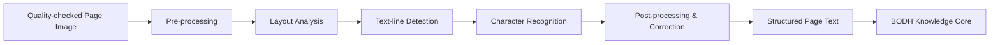

# OCR — Optical Character Recognition Layer

OCR is the text-extraction sub-component of APTBS. It receives quality-checked page images from the scanning pipeline and converts them into machine-readable text, enabling the BODH Knowledge Core to search, index, summarise, and retrieve content from digitised books and documents.

---

## Parent Project

This component is part of **BODH — Bharat Organised Digital Heritage**.

Parent repository: [https://github.com/Utkarshaglitched/BODH](https://github.com/Utkarshaglitched/BODH)

## Reference Repository

This component takes reference from:

[https://github.com/vinayakagga/OCR](https://github.com/vinayakagga/OCR)

The BODH implementation is adapted for the BODH architecture and specifically targets Indian heritage material, including historical typography and multi-script documents.

---

## Role in BODH

A scanned page is just an image. Without OCR, a digitised book remains a collection of photographs — visually preserved but computationally opaque. OCR is the layer that transforms an image of printed text into a sequence of characters that a machine can process.

In the BODH pipeline, OCR output is the primary input for knowledge ingestion. Every piece of text the BODH Knowledge Core knows about — every speech, every letter, every chapter — reached it as OCR-extracted text that originated from a physical document scanned by APTBS.

```
Page Image (from APTBS capture stage)
    ↓
OCR / Text Extraction  (this component)
    ↓
Structured Text + Metadata
    ↓
BODH Knowledge Core
    ↓
Search · Retrieval · Summarisation · AI Response
```

---

## Problem

Scanned images of historical books are difficult to work with. Fonts change between eras and publishers. Pages yellow, ink fades, and print bleeds through from the reverse side. Binding curves distort lines near the spine. Some documents mix two or more scripts on the same page. Standard OCR engines trained on modern, clean typography perform poorly on this kind of material.

The OCR layer must handle:

- Low-contrast or faded print
- Non-standard or archaic typefaces
- Skewed or curved text lines
- Mixed-language and mixed-script pages
- Marginal annotations and stamps
- Physical damage such as tears, stains, or water marks

---

## How It Works

The OCR stage sits immediately after the image quality check in the APTBS pipeline. It processes one page image at a time and returns structured text for that page.



### Pre-processing

Before recognition, the image is prepared to maximise accuracy:

- Deskew and straighten text lines
- Binarisation (convert greyscale to black-and-white)
- Noise reduction to remove speckles and artefacts
- Contrast enhancement for faded or low-quality prints

### Layout Analysis

The page is divided into its logical regions: main body text, headings, footnotes, page numbers, captions, and margins. This prevents the recogniser from mixing text from different regions or reading columns in the wrong order.

### Text-line Detection and Character Recognition

Individual text lines are identified and passed to the recognition engine, which maps pixel patterns to characters and builds word sequences. Language model context is applied to resolve ambiguous characters based on surrounding words.

### Post-processing

Raw recognition output is cleaned up: common OCR substitution errors are corrected (for example `0` vs `O`, `l` vs `1`), hyphenation across line breaks is resolved, and running headers or page numbers are separated from body content.

---

## Output

For each page, the OCR stage produces:

| Output | Description |
|---|---|
| Plain text | Continuous body text, suitable for indexing and search |
| Structured text | Text with heading levels, paragraph breaks, and footnote markers where detectable |
| Confidence score | A per-page quality indicator used to flag low-confidence pages for manual review |
| Bounding boxes | Optional word/character position data, useful for linking back to the source image |

---

## Relationship with APTBS

OCR is a sub-component of APTBS. It does not operate independently — it receives its inputs from the APTBS capture and quality-check stages, and its outputs are packaged into the archive bundle that APTBS delivers to the BODH Knowledge Core.

See [`../README.md`](../README.md) for the complete APTBS pipeline context.

---

## Limitations

OCR on historical material is not perfect. The following limitations are acknowledged and inform the design of the downstream knowledge pipeline:

- **Recognition accuracy degrades** on severely damaged, hand-annotated, or very faded pages
- **Handwritten text** is outside the scope of standard OCR; this requires Handwritten Text Recognition (HTR), which is a planned future extension
- **Complex layouts** such as multi-column newspapers or tables may produce incorrectly sequenced output
- **Rare scripts or archaic typefaces** may require specialised models not yet available
- **Confidence scores are estimates** — a high-confidence page can still contain errors, particularly in proper nouns and uncommon words

Downstream BODH components are designed to work with imperfect OCR input. Source images are always preserved so that any extraction error can be traced back to and corrected from the original scan.

---

## Future Expansion

- Specialised recognition models for Devanagari, Tamil, Bengali, Urdu, and other Indian scripts
- Handwritten Text Recognition (HTR) for pre-print manuscripts and correspondence
- Table and structured-data extraction
- Automatic language identification for mixed-script pages
- Active learning loop: corrections made during knowledge curation feed back into model improvement
- Integration with national archival metadata standards

---

## Status

> **Development stage.** The OCR sub-component is being integrated with the APTBS scanning pipeline. Model selection and fine-tuning for Indian historical typography is ongoing.
