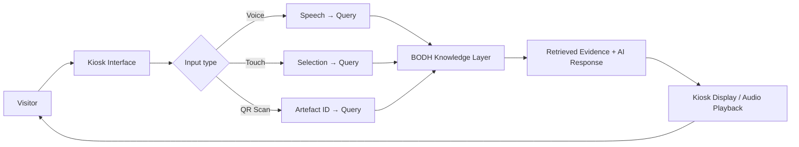

# Kioks_UI — BODH Kiosk Interface

Kioks_UI is the museum-facing client layer of BODH. It presents visitors with a touch and voice interface that allows them to explore exhibits, ask questions about artefacts and historical figures, and receive contextual responses drawn from the BODH Knowledge Core. The interface is designed to work with existing museum infrastructure and requires no technical knowledge from the visitor.

---

## Parent Project

This component is part of **BODH — Bharat Organised Digital Heritage**.

Parent repository: [https://github.com/Utkarshaglitched/BODH](https://github.com/Utkarshaglitched/BODH)

## Reference Repository

This component takes reference from:

[https://github.com/KaunAnkit/tour_guide](https://github.com/KaunAnkit/tour_guide)

The tour_guide project describes a B.R. Ambedkar Museum voice tour guide with touch-first interaction, voice capture, artefact cards, and a FastAPI backend. The BODH kiosk interface is inspired by this design and adapted for the BODH architecture, where the intelligence layer is the BODH Knowledge Core rather than a standalone backend.

---

## Role in BODH

The kiosk is the public face of the BODH system. It does not contain the knowledge — it connects to it. Visitors interact with the kiosk, which translates their questions and touch actions into queries that travel to the BODH Knowledge Core. Retrieved evidence and AI-generated responses return to the kiosk and are presented to the visitor as text, audio, artefact records, or related media.

```
Visitor
   ↓
Kiosk Interface  (this component)
   ↓
Question / Touch / QR
   ↓
BODH Knowledge Layer
   ↓
Retrieved Evidence
   ↓
Response + Related Records
   ↓
Visitor Exploration
```



---

## Problem

Museum visitors often know very little about the exhibits in front of them. Static labels and printed guides provide a fixed amount of information in a single language, cannot answer follow-up questions, and go out of date. The kiosk replaces the static label with a live, conversational connection to the full depth of knowledge that BODH has built from digitised archives and collections.

---

## Visitor Experience

### Interaction Modes

**Voice interaction** — The visitor speaks a question naturally. The kiosk captures the audio, sends it for transcription, and returns a spoken response alongside a visual summary. This is the primary interaction mode and requires no literacy or technical skill.

**Touch interaction** — The visitor browses a structured interface: artefact categories, historical figures, themes, and timelines. Tapping an item retrieves detailed information, connected records, and related exhibits.

**QR code scanning** — Physical labels on exhibits carry QR codes. Scanning a code immediately loads the full BODH record for that artefact, including its provenance, digitised source documents, and contextual history.

### What a Visitor Can Explore

- Background and life of historical figures associated with the museum
- Details of specific artefacts — origin, significance, related events
- Speeches, writings, and documents connected to an exhibit
- Related exhibits within the same museum and, in future, across Panchteerth sites
- Multilingual responses, enabling visitors who are not comfortable in the local language to engage in their own language
- Audio playback of responses for accessibility and for visitors who prefer listening

### Artefact Cards

When a query returns a specific artefact or document, the kiosk displays an artefact card: a structured visual record showing the item's image (where available), title, category, a short description, and links to related records. This mirrors the card-based design approach used in the reference tour_guide project.

---

## Architecture

The kiosk interface is a client layer. It handles input capture, display, and audio playback. All knowledge retrieval and AI reasoning happens in the BODH Knowledge Layer, which the kiosk communicates with over a standard API.

```
Kiosk Device
┌─────────────────────────────────┐
│  Frontend UI                    │
│  • Touch / display              │
│  • Mic capture                  │
│  • Audio playback               │
│  • Artefact card rendering      │
└──────────────┬──────────────────┘
               │ HTTPS / API
┌──────────────▼──────────────────┐
│  BODH Server (Ther_server_side) │
│  • Query handling               │
│  • Knowledge retrieval          │
│  • AI response generation       │
│  • Artefact record service      │
└─────────────────────────────────┘
```

The frontend is built with standard web technologies so that it can run on any capable museum device — a tablet, a dedicated kiosk terminal, or a wall-mounted touchscreen — without requiring device-specific native applications.

---

## Museum Infrastructure Integration

The kiosk is intended to complement existing museum setups:

- Runs on standard web-capable hardware; no specialised display required
- Can be deployed as a self-contained unit or integrated into an existing exhibit layout
- QR codes can be added to existing physical labels with no changes to the label itself
- Network connectivity to the BODH server is the only infrastructure requirement
- Designed for low-maintenance operation in a public-facing environment

---

## Multilingual Capability

The kiosk is designed to support multiple languages so that BODH can serve visitors regardless of their primary language. Voice questions can be asked in the visitor's language of preference, and responses are returned in the same language where supported by the underlying knowledge and speech models. This is particularly important for heritage sites that receive visitors from across India and internationally.

---

## Deployed Instance

A live reference deployment based on the tour_guide design is accessible at:

[https://smarak.onrender.com/](https://smarak.onrender.com/)

This deployment serves as the reference experience for the BODH kiosk interface.

---

## Future Expansion

- Offline mode for museum environments with unreliable connectivity
- Multi-kiosk coordination for guided group tours
- Accessibility enhancements: screen reader support, adjustable text size, high-contrast mode
- Integration with SAHAYAK for portable in-gallery assistance
- Cross-site discovery: connecting visitors to related holdings at other Panchteerth locations
- Analytics dashboard for museum staff to understand visitor engagement patterns

---

## Status

> **Reference design deployed.** The kiosk experience at [smarak.onrender.com](https://smarak.onrender.com/) demonstrates the interaction model. Full integration with the BODH Knowledge Core and SAHAYAK is in progress.
