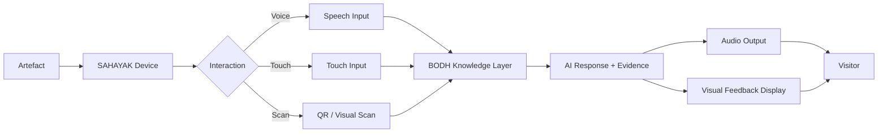

# SAHAYAK — Portable Heritage Assistant

SAHAYAK is the physical, human-facing interaction layer of BODH. Where the kiosk is fixed to a wall or counter, SAHAYAK is designed to travel with the visitor — or to be placed at the artefact itself. It provides voice, touch, and scan-based access to the BODH Knowledge Core from anywhere within the museum, bridging the gap between a physical exhibit and the digital knowledge built around it.

*Sahayak* (सहायक) means *helper* or *assistant* in Hindi — the name reflects its role as a portable guide that supports visitors throughout their museum experience.

---

## Parent Project

This component is part of **BODH — Bharat Organised Digital Heritage**.

Parent repository: [https://github.com/Utkarshaglitched/BODH](https://github.com/Utkarshaglitched/BODH)

---

## Role in BODH

BODH operates as a two-layer system: a knowledge layer and an interaction layer. SAHAYAK is an interaction layer component. It does not store or reason over the archive itself — it connects the visitor to BODH and presents the retrieved knowledge through audio and visual output.

```
Artefact / Exhibit
   ↓
SAHAYAK
   ↓
Voice / Touch / Scan
   ↓
BODH Knowledge Layer
   ↓
Evidence Retrieval
   ↓
AI Response
   ↓
Audio / Visual Response
   ↓
Visitor
```



---

## Problem

A kiosk is a fixed point. Visitors move. Many of the most meaningful moments in a museum happen in front of a specific artefact, not at a help station. SAHAYAK addresses this by placing an intelligent, conversational interface at the point of encounter — whether that is a portable handheld device carried by a visitor or a compact unit mounted near the artefact itself.

---

## Conceptual Capabilities

### Voice Interaction
The visitor speaks a question directly to SAHAYAK. The device captures the audio, transmits it to the BODH Knowledge Layer, and plays back the response through a speaker. No typing or navigation is required, making the experience accessible to all visitor types.

### Visual Feedback
A small display or indicator on the device provides visual confirmation of recognised input, shows key information such as an artefact name or related image, and communicates connection and processing status so the visitor knows the device is working.

### Touch Input
For visitors who prefer not to use voice, or in noisy gallery environments, a touch interface allows navigation through categories, artefact records, and related content.

### Artefact Association via Scan
SAHAYAK can scan a QR code or visual marker placed on or near an exhibit. This immediately loads the BODH record for that specific artefact — its provenance, connected documents, related historical figures, and curated context — without the visitor needing to describe or search for it.

### Contextual Responses
Because SAHAYAK connects to the BODH Knowledge Core, its responses are source-aware. When BODH retrieves information, it can attribute the response to a specific digitised document, speech, or archival record, allowing the visitor to understand where the information comes from.

---

## Design Philosophy

SAHAYAK is the physical interaction layer. BODH is the knowledge layer. This separation is intentional:

- SAHAYAK can be updated, redesigned, or replaced without changing the underlying knowledge architecture
- BODH can grow its archive without requiring hardware changes to SAHAYAK
- Multiple SAHAYAK units can operate simultaneously, all drawing from the same knowledge source
- The same knowledge served to SAHAYAK is also served to the fixed kiosks, ensuring consistency across the museum experience

---

## Hardware Documentation

Hardware pin mappings, wiring diagrams, component specifications, and final enclosure design will be documented after the hardware interface is finalised.

The SAHAYAK hardware design is currently being developed. Pin diagrams, BOM (Bill of Materials), and assembly instructions will be added to this section once the design is confirmed.

> **Do not treat any hardware details as final until this section is explicitly updated.**

---

## Future Expansion

- Multi-language support so visitors can interact in their preferred language
- Integration with the fixed kiosk network for a seamless transition between portable and fixed interfaces
- Tactile and audio-only modes for visitors with visual impairments
- Group tour mode: a single SAHAYAK unit providing a narrated walk-through with coordinated timing
- Connectivity with BODH's planned multi-site Panchteerth network, allowing a visitor at one site to access knowledge held at another

---

## Status

> **Conceptual and early design stage.** The role and interaction model for SAHAYAK are defined. Hardware implementation and software integration with the BODH Knowledge Layer are pending hardware finalisation.
