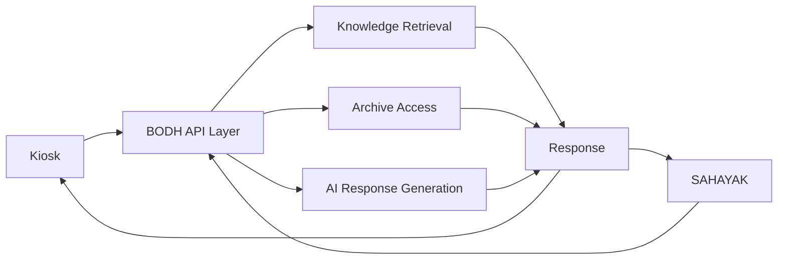

# Ther_server_side — BODH Server Layer

Ther_server_side is the centralised service layer of BODH. It sits between the client interfaces — the kiosks and SAHAYAK — and the knowledge, archive, and AI services that power them. Every question a visitor asks, every artefact a kiosk displays, and every document retrieved from the archive passes through this layer.

---

## Parent Project

This component is part of **BODH — Bharat Organised Digital Heritage**.

Parent repository: [https://github.com/Utkarshaglitched/BODH](https://github.com/Utkarshaglitched/BODH)

---

## Role in BODH

The server layer is the connective tissue of the system. Client devices such as kiosks and SAHAYAK units are lightweight — they capture input and display output. The server layer handles everything in between: receiving the query, retrieving relevant knowledge, invoking AI reasoning, and returning a structured response.

```
Client / Interface layer
(Kiosk · SAHAYAK)
        ↓
API / Server Layer  (this component)
        ↓
BODH Knowledge Services
(Retrieval · Archival access · AI reasoning)
        ↓
Archive / Retrieval / AI
```



---

## Problem

Without a centralised server layer, each kiosk would need to carry its own copy of the archive, its own retrieval index, and its own AI model. That is not feasible at scale — archives grow, models improve, and consistency across dozens of museum devices would be impossible to maintain. The server layer solves this by making the knowledge available as a service: devices are thin clients, and all intelligence lives centrally.

---

## Responsibilities

| Responsibility | Description |
|---|---|
| API endpoint handling | Receives requests from kiosks, SAHAYAK, and any authorised client |
| Knowledge retrieval | Searches the BODH archive and returns relevant documents, passages, and records |
| AI response generation | Passes retrieved context to a language model and returns a coherent, source-attributed response |
| Archival content access | Serves digitised page images, extracted text, and document metadata from the archive |
| Health and status monitoring | Provides a health endpoint so deployment infrastructure can verify service availability |
| Authentication and access control | Ensures that only authorised clients can query the knowledge layer |

---

## Current Prototype

The current prototype serves as the backend for the reference kiosk deployment at [smarak.onrender.com](https://smarak.onrender.com/). It is built with Python and FastAPI, uses ChromaDB as a vector store for semantic retrieval of museum content, and integrates with the Groq API for language model inference and Whisper-based speech transcription.

Key endpoints in the prototype:

- `POST /converse` — accepts an audio file, transcribes it, retrieves relevant museum content, generates a response, and returns audio + text + artefact cards
- `GET /health` — returns service status including vector store document count and API key presence

The prototype demonstrates the interaction model and serves as the integration target for kiosk and SAHAYAK clients.

---

## Planned / Production Architecture

The following describes the intended production architecture. These components are architectural plans and are **not yet implemented**.

### Knowledge Store

A vector search index over the full BODH archive, enabling semantic retrieval of relevant passages from digitised books, speeches, and documents in response to natural-language queries.

### Archive Storage

Long-term storage for digitised page images, extracted text, and document metadata produced by the APTBS scanning pipeline. Designed for high durability and reliable access.

### Structured Metadata

A structured store for artefact records, museum collection metadata, entity relationships (people, events, places, documents), and provenance data.

### AI Inference

Language model inference for response generation, grounded in retrieved archival evidence. Responses are attributed to source documents so visitors and curators can verify the basis of any answer.

### Multi-site Connectivity

The production architecture is intended to support the Panchteerth network — a group of five heritage sites associated with the life of Dr. B.R. Ambedkar. Each site will have its own BODH-connected kiosks, with the server layer providing cross-site knowledge access so a visitor at one location can discover connected holdings at another.

---

## Separation of Concerns

A deliberate design principle of BODH is that the server layer is distinct from the client layer:

- **Clients** (kiosks, SAHAYAK) handle input capture and output presentation only
- **The server layer** handles all knowledge, retrieval, and AI reasoning
- **The archive** (APTBS output) feeds the server layer, not the clients directly

This means the knowledge base can be updated — new books added, new models deployed — without touching museum hardware.

---

## Status

> **Prototype operational.** The prototype backend supports the live kiosk deployment. Production-scale architecture with a full archival knowledge base, structured metadata, and multi-site connectivity is planned and under design.
